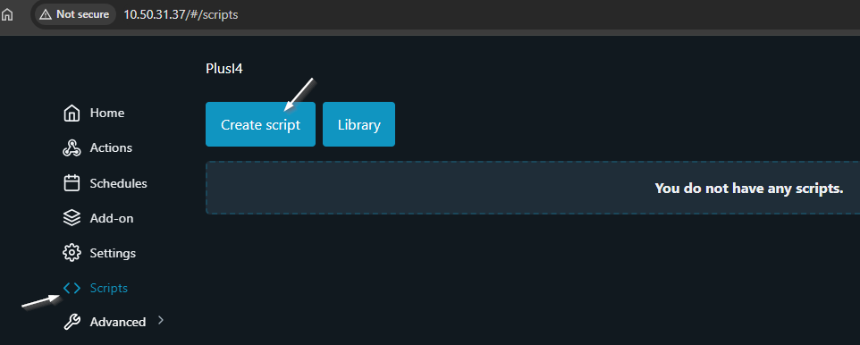
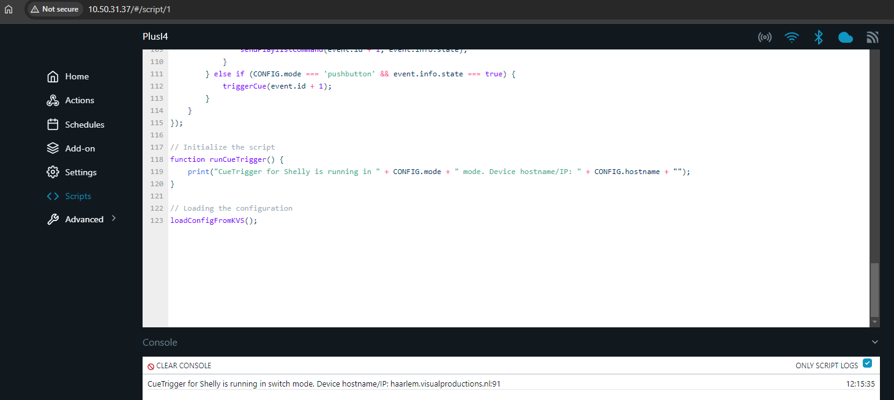

### CueTrigger for Shelly - Installation Instructions  

---


**Required Devices:**
- **Visual Productions Device:** A CueCore2, CueCore3, QuadCore, or Cuety LPU-2 device
- **Shelly Device:** Ensure you have a device that supports scripting (Gen2+ devices) and has input instances (e.g., Shelly Plus i4, which has four inputs)
- **Pushbuttons/Switches:** Wired switches that connect to the Shelly device for triggering cues

---

**Hardware Setup:**
- Connect the pushbutton or switch to your Shelly device. Follow the wiring instructions in the Shelly documentation
- Ensure your CueCore or related Visual Productions device is connected to the same network as your Shelly device


---

1. **Download and edit configuration:**
   - Download the [cuetrigger-for-shelly.js](script/cuetrigger-for-shelly.js) file
   - Open the file with a text editor to edit the configuration section

2. **Configuration section:**
   - **hostname:** Enter the hostname or IP address of the Visual Productions device (e.g., `192.168.33.2`)
   - **deviceType:** Select your device type. Options include: `'CueCore'`, `'QuadCore'`, `'CuetyLPU2'`
   - **mode:** Choose your preferred mode. Options are: `'switch'`, `'pushbutton'`

3. **Playback IDs:**
   - Specify the playback IDs for each switch/pushbutton. The ranges are:
     - CueCore2: `01-08`
     - CueCore3: `01-16`
     - QuadCore: `01-06`
     - Cuety LPU-2: `01-64`
   - Example:
     - `pbId1`: Playback ID for switch/pushbutton 1
     - `pbId2`: Playback ID for switch/pushbutton 2
     - `pbId3`: Playback ID for switch/pushbutton 3
     - `pbId4`: Playback ID for switch/pushbutton 4

4. **Cue IDs:**
   - Enter the Cue IDs for each switch/pushbutton. The ranges are:
     - CueCore 2, CueCore 3 and QuadCore: `1-32`
     - Cuety LPU-2: `1-48`
   - Example:
     - `cueId1`: Cue ID for switch/pushbutton 1
     - `cueId2`: Cue ID for switch/pushbutton 2
     - `cueId3`: Cue ID for switch/pushbutton 3
     - `cueId4`: Cue ID for switch/pushbutton 4

       

6. **Default script example:**
     - The values set in the configuration section will be the default values. However thanks to KVS (Key-Value Storage), you can update them remotely later without modifying the script directly in the Shelly web interface

7. **Add the script to your Shelly device:**
   - Open your web browser and enter the hostname/IP of your Shelly device
   - Click on the "Scripts" menu option
   - Click the "Create script" button
     
     
     
   - In the "Script name" field, name the script (for example, CueTrigger for Shelly)
   - Paste the code into the white field and click "Save"
   - Press "Start". In the "Console" box you should now see the text: "CueTrigger for Shelly is running in switch mode. Device hostname/IP:"
  
      

8. **Example command to update configuration using KVS:**
   - To connect to the Shelly device at `192.168.33.1` and update the Cue with ID 2 to `32`, open your web browser and enter the following URL:
     ```
     http://192.168.33.1/rpc/KVS.Set?key="cueId2"&value="32"
     ```
9. **Restart the script after updating a KVS variable:**
   - Stop script 1:
     ```
     http://192.168.33.1/rpc/Script.Stop?id=1
     ```
   - Start script 1:
     ```
     http://192.168.33.1/rpc/Script.Start?id=1
     ```
