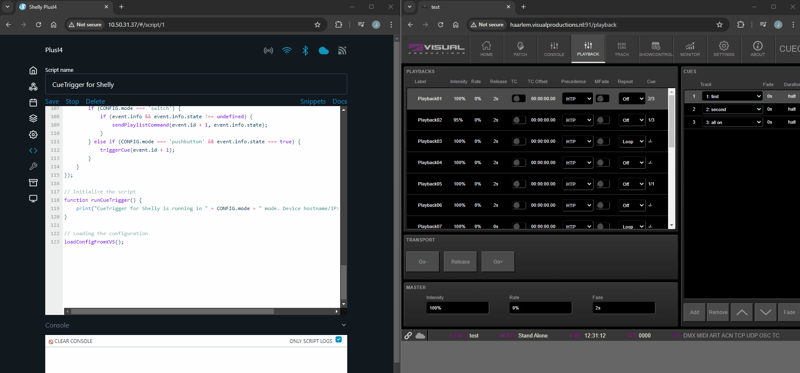

### CueTrigger for Shelly

gobo.ws has developed an open-source script that integrates [Shelly devices](https://www.shelly.com/) with a switch or pushbutton to wirelessly trigger or stop cues on CueCore2, CueCore3, QuadCore, or Cuety LPU-2 devices from [Visual Productions](https://www.visualproductions.nl/).

Switch mode will send the command `Playback jump` / `Release playback`, pushbutton mode will send the command: `Playback jump`. 

While Shelly products are typically designed for IoT applications, they can also offer a cost-effective control solution for professional use. For instance [Rigport](https://rigport.com/) incorporates Shellies into their SmartVT range. However the reliability of 2,4 GHz Wi-Fi in certain environments should be carefully considered.

This wireless solution serves as a simple alternative to the CueCore's GPI ports or B-Station, particularly in situations where running signal cables to a switch or push button is impractical.
The setup is straightforward and offers an affordable option, with the only cost being the purchase of a compatible Shelly device.

Supported devices from Shelly include the Gen2+ devices with input instances. Some examples are the Shelly Plus I4, Shelly Plus 1 (Mini), Shelly Plus 1 PM (Mini), Shelly Plus 2 PM, Shelly Plus Uni, Shelly Pro 1, Shelly Pro 1 PM, Shelly Pro 2, Shelly Pro 2 PM, Shelly Pro 3, Shelly Pro 4 PM and Shelly Pro Dual Cover PM. However the number of inputs depends on the model.

For testing purposes, a Shelly Plus i4 DC is used, allowing it to trigger four different cues in combination with the online CueCore3 demo unit.

---
[Installation Instructions](INSTALL.md) | ↓ [Download script](https://raw.githubusercontent.com/gobo-ws/cuetrigger-for-shelly/refs/heads/main/script/cuetrigger-for-shelly.js)

---

[gobo.ws can help customize solutions](mailto:hello@gobo.ws) to meet your specific needs. I can also develop scripts for other devices from Visual Productions, in addition to the ones I already support and create solutions for products from other manufacturers.

---

© 2024 gobo.ws. All rights reserved.
Visual Productions, Shelly and Rigport are trademarks of their respective owners.
